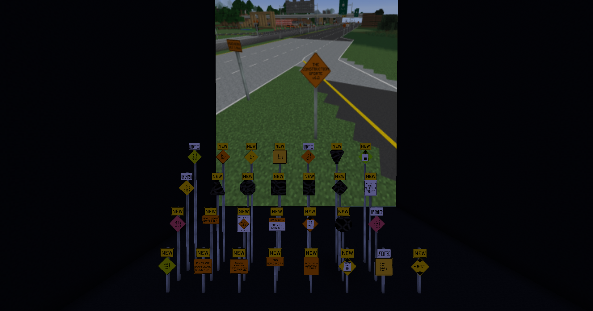

UPDATE:
V7
https://github.com/Gamearoo-s-Development/Usefull-Signs/releases/tag/v7.0
https://www.curseforge.com/minecraft/mc-addons/usefull-signs
wiki - https://github.com/Gamearoo-s-Development/Usefull-Signs/wiki

Adds some construction signs and other suggested signs

INTRODUCES MULTIBLOCK SIGNS

Total of 126 Total Sign Blocks (124 Main signs) (2 Multi-block sign)

A Bunch of changes full notes on githubs release changelogs

move suggestions & Issues to https://discordapp.com/channels/541808000537591821/1211730819618570240 or https://github.com/Gamearoo-s-Development/Usefull-Signs/issues

Credits:
@gamearoo - Owner/Editor/Design
@the_epicness9000 - Design